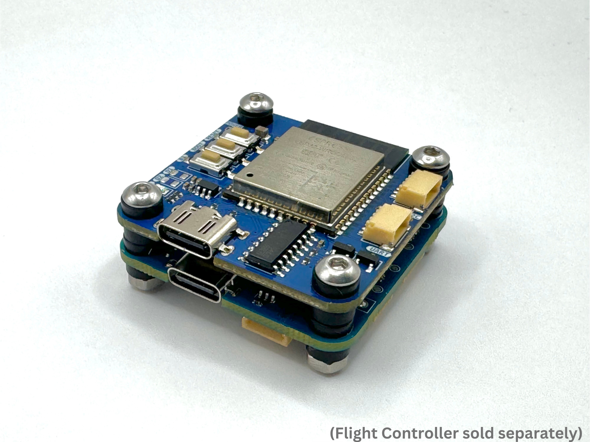
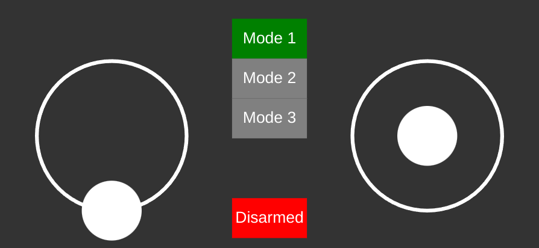
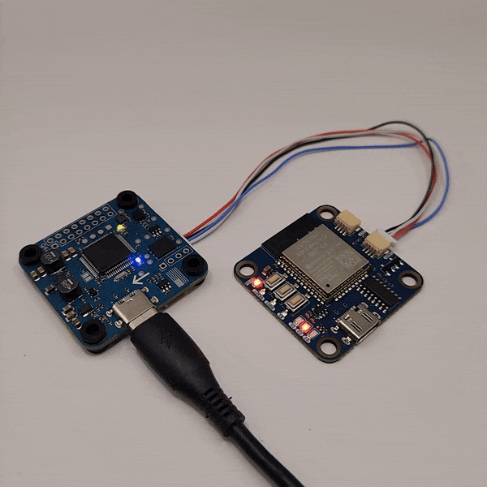
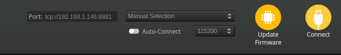

# PrincipIoT Node Examples

The PrincipIoT Node is an ESP32 coprocessor designed for use on FPV drones. Easily add wireless connectivity, or extend the functionality of your flight controller through custom programs without needing to modify the flight controller. It's the same footprint as a standard 30x30mm flight controller for easy integration.

This repository contains three example Arduino applications powered by the PrincipIoT Node.
### **RC Control**: Fly a drone from your phone using just a web browser.

This example highlgihts the WiFi connectivity of the onboard ESP32 by hosting a WiFi network and web page where you can fly an attached drone. The onboard touchscreen commands are translated to RC commands and sent to the onboard flight controller.

### **Aux LED**: Control the LEDs on the Node from a spare RC channel.

One of the goals of the PrincipIoT Node is to provide an easy platform to extend the functionality of a flight controller. Rather than having to modify the flight controller firmware, a coprocessor like the Node can implement new functionality by interfacing with the flight controller over MultiWii Serial Protocol (MSP). This example shows one way to do this, listening to the RC inputs received by the flight controller to command the state of the LEDs on the Node.

### **WiFi Serial Bridge**: Ditch the cords and configure your drone over WiFi.

Once uploaded, the UART port on the Node will be mapped to TCP port 8881 and UDP port 14551. Instead of connecting over USB in INAV or Betaflight configurator, select TCP or UDP and provide the URL in the form `tcp://<IP address>:8881` or `udp://<IP address>:14551`.

There are also several options available for configuration in the `config.h` file.

ESP-Serial-Bridge is linked from the original repository [here](https://github.com/yuri-rage/ESP-Serial-Bridge), under the MIT license.

## Hardware
The PrincipIoT Node is available for sale on [Tindie](https://www.tindie.com/products/principiot/principiot-node-esp32-for-fpv-drones/)

To connect to a flight controller, plug the Node's UART into a free UART on the controller. This can be done by creating a custom cable, using the included JST-SH connectors and precrimper wires. The pinout of the UART connector is marked on the back side of the board.

Once connected, enable MSP on the flight controller for that UART, and you're all set.

**Important**: Remember to connect RX of the Node to TX on the flight controller and TX of the node to RX on the flight controller.

## Software
These examples are written in Arduino. To upload these, you'll need the Arduino ESP32 core either through the Arduino IDE or PlatformIO. Espressif (the maker of the ESP32) provides instructions for environment setup here: [https://docs.espressif.com/projects/arduino-esp32/en/latest/installing.html](https://docs.espressif.com/projects/arduino-esp32/en/latest/installing.html)

When uploading in the Arduino IDE, select the "ESP32  Dev Module" for the board type.

## License
This software is licensed under the MIT License. See the License file for more information.